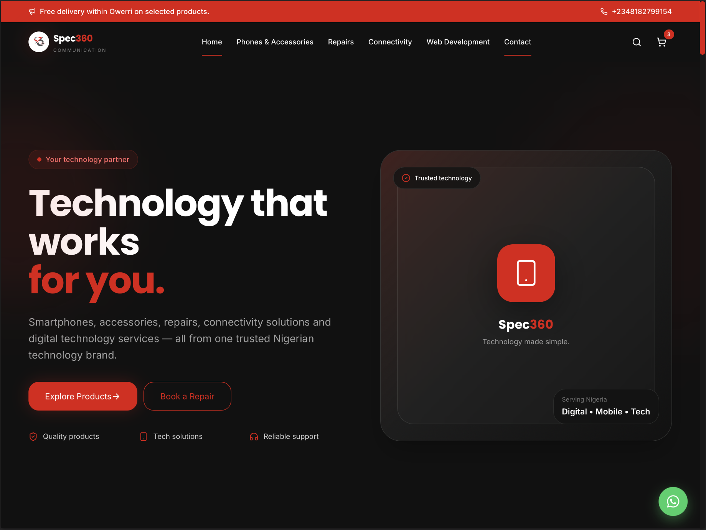
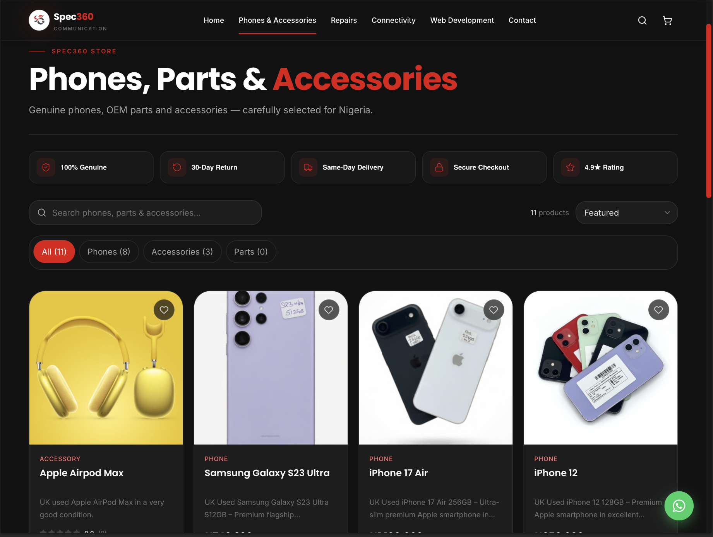
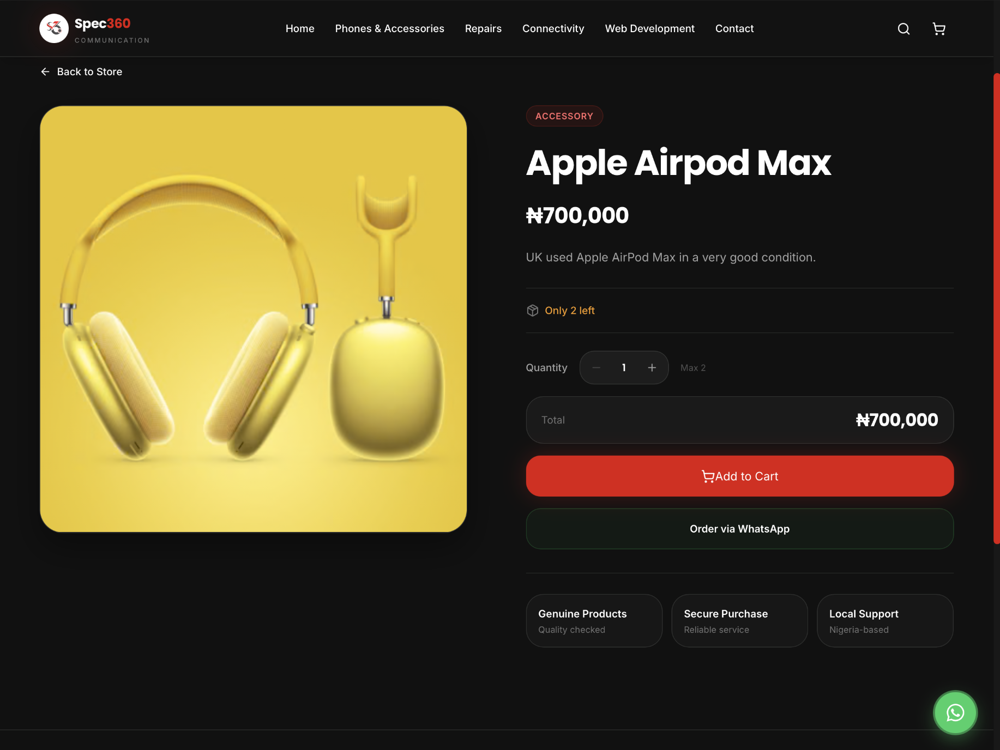
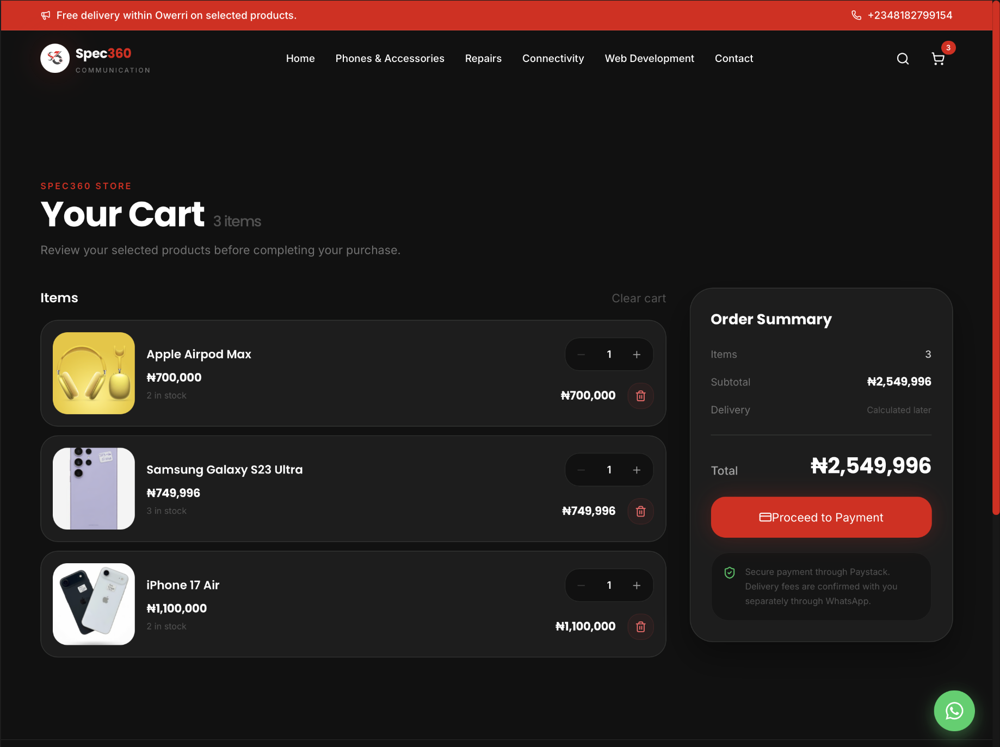

# SPEC360 Communication



## Modern E-commerce & Technology Platform

SPEC360 Communication is a full-stack technology and e-commerce platform built for SPEC360 Communication.

The platform provides customers with an online storefront for browsing technology products, viewing product details, managing their cart, checking out securely and making online payments.

The system also includes an authenticated administration dashboard for managing products, inventory and customer orders.

---

## Live Website

https://spec360.com.ng

---

## Project Overview

SPEC360 combines:

- E-commerce
- Product catalogue
- Product management
- Shopping cart
- Checkout
- Paystack payments
- Order management
- Inventory management
- Admin dashboard
- Responsive UI
- Customer-focused UX

The project is structured as a full-stack JavaScript application with a separate frontend and backend.

---

# Features

## Customer Features

- Responsive homepage
- Product catalogue
- Product search
- Product filtering
- Product details
- Product image gallery
- Shopping cart
- Quantity management
- Checkout
- Customer information collection
- Paystack payment integration
- Payment verification
- Order creation
- Order status tracking
- Mobile-friendly interface
- Responsive desktop interface

---

## Admin Features

- Secure admin authentication
- Admin dashboard
- Add products
- Edit products
- Delete products
- Update product stock
- Product management
- View customer orders
- View individual order details
- Update order status
- Mark paid orders as fulfilled
- Order management
- Inventory management

---

# Screenshots

## Homepage


The homepage introduces SPEC360, highlights the business, showcases key services and provides access to the online store.

---

## Product Catalogue



The product catalogue allows customers to browse available products and discover items available for purchase.

---

## Product Details



The product details page provides customers with product information, pricing, availability, imagery and purchasing options.

---

## Shopping Cart



The cart allows customers to review selected products, adjust quantities and proceed to checkout.

---

# Technology Stack

## Frontend

- React
- JavaScript
- Vite
- Tailwind CSS v4
- Framer Motion
- React Router
- Axios
- Lucide React
- React Intersection Observer
- React Scroll

---

## Backend

- Node.js
- Express.js
- MongoDB
- Mongoose
- JWT Authentication
- Paystack API
- REST API

---

## Development Tools

- Vite
- ESLint
- Git
- GitHub
- npm

---

# Project Structure

```text
spec360-website/
│
├── client/
│   ├── public/
│   ├── src/
│   │   ├── assets/
│   │   ├── components/
│   │   ├── config/
│   │   ├── context/
│   │   ├── hooks/
│   │   ├── layouts/
│   │   ├── pages/
│   │   ├── services/
│   │   ├── App.jsx
│   │   └── main.jsx
│   │
│   ├── index.html
│   ├── package.json
│   └── vite.config.js
│
├── server/
│   ├── config/
│   ├── middleware/
│   ├── models/
│   ├── routes/
│   ├── services/
│   ├── utils/
│   ├── server.js
│   └── package.json
│
├── docs/
│   └── screenshots/
│       ├── homepage.png
│       ├── products.png
│       ├── product-details.png
│       └── cart.png
│
├── TERMS_AND_CONDITIONS.md
├── PRIVACY_POLICY.md
├── .gitignore
└── README.md